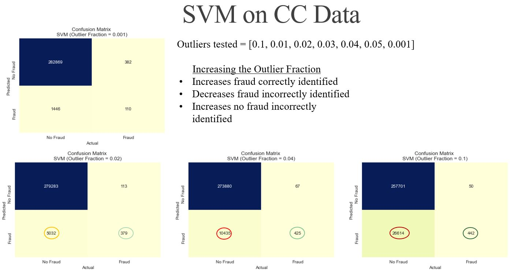

# Anomaly Detection using Machine Learning

This project was designed to experiment with various machine learning applications for anomaly detection. The projects is made up of 3 parts:
* 1. Unsupervised Techniques
* 2. Unsupervised models on labeled credit card data
* 3. Supervised models on the labeled credit card data.

## Unsupervised Techniques
The first part of the project explores Unsupervised Techniques on various anomaly data sets available online. The four data sets used were:
* Amazon East Coast AWS datacenter CPU usage
* Temperature of an internal component of a large industrial machine
* Ambient temperature in an office
* Amazon Web Services average CPU usage across a given cluster

These data sets are from the NAB (Numenta Anomaly Benchmark) and are used as a benchmark tool for identifying anomalies. The goal is to predict exactly when the anomalies occurred using unsupervised techniques. Below is a visualisation of the data sets used along with an overview of the various unsupervised methods to be tested:

The algorithms tested are:
* k-means
  * centroid measurement for anomaly detection
  * Gaussian Distribution for anomaly detection
* Isolation Forest
* SVM
* LSTM Neural Networks

### Feature engineering

The first part of the project was designed to identify patterns in the data. The variation in the data over time was analyzed to identify the various time steps that should be used. This can be seen below:

#### PCA & K-means Clustering

As the data was expanded into higher dimensional data, principal component analysis was explored for the application of k-means clustering. Two principal components were chosen and then each data set had k-means clustering applied. The elbow method is used to identify the ideal number of clusters for each set:

The data was then visualised using the principal components and the cluster assignments:

### Other Unsupervised Techniques

The next step was to run the various other unsupervised techniques to try and identify how many anomalies each algorithm would predict. Below is an example of the AWS CPU temperature data set being tested against the various algorithms. The number of anomalies detected by each algorithm can be found below the graphs:

An outlier fraction of 0.001 is used throughout and the algorithms are compared with each other across each dataset.

## Unsupervised models on labeled credit card data

Below is an image detailing the general overview of this next stage of the project. The general idea is to build up a fraud detection model by first working with a completely unlabeled (unsupervised) data set. Over time, the fraud department would be able to feed back into the model whether it had correctly identified a fraud case or not. Once enough data is collected, the project would then become a supervised technique.

For this part of the project a dataset of credit card transactions with known fraud cases labeled is used. The data contains amount of the purchase, along with 28 additional normalized features. The previous algorithms are then applied to the data, to identify which algorithm might be the most useful in the early stages of fraud detection.

An outlier fraction of 0.001, 0.02, 0.01 and 0.1 were used/

Each model was evaluated using a confusion matrix against the known cases of fraud. This was simply used to help identify which algorithm could be useful when the problem is completely unsupervised. The idea was to identify as many cases of fraud as possible, without overwhelming the fraud department with false flag instances. As an example, the use of PCA and K-means and the SVM models can be seen below:

## Supervised models on the labeled credit card data
In the final part of this project the following models were used for training/testing:
* Logistic Regression
* K-nearest neighbor
* Supprt Vector Machine
* Decision Tree
* Neural Network
* XGBoost

The models are accessed using accuracy, precision, recall and F1 score. The best model was then selected for Hyperparameter tuning using a grid search algorithm. The tuning was conducted twice, once optimizing for the Precision score, and a second time optimizing for the F1 score.

The conclusion of the project provides an overview of which models should be used when no labeled data is available, when only a limited amount of data is available, and when a substantial amount of labeled data is collected.

Please see the Jupyter Notebooks for further information.
